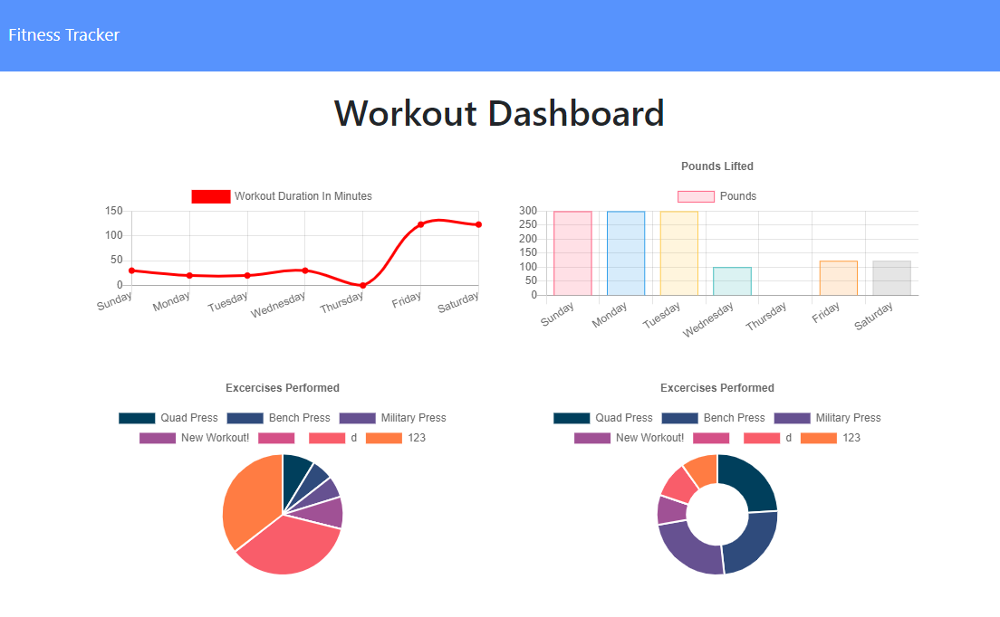

# Workout Tracker 

### Project Links

This site is deployed on Heroku [here](https://fathomless-brushlands-39978.herokuapp.com/)

The GitHub repo is [here](https://github.com/MrCartree/weather-dashboard/edit/master/readme.md)... Literally this site and page that youre currently on...

### Description

This is a workout tracker meant to add workout and track your weight, and duration and everything like that. There is a "stats" page that will show you all your work outs and map out all the information you could desire about that.

### Screenshot

### Challenges

A few of the challenges that I went through were working with the front end and making sure that the Total Duration would show up. Another challenge was getting the seeds file to interact with my models. Eventually I was able to get it to work by adjusting my models file.